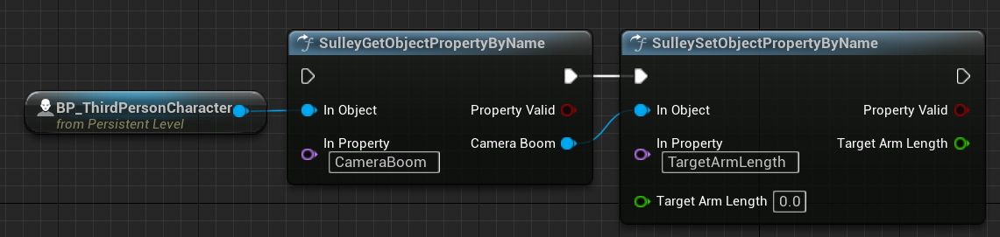

# Get / Set Object Properties by Name
This is a toy plugin for Unreal Engine to access (get and set) any object property by name. It works on UE v5.1 and can be transferred to other versions with little effort.

Use is very simple, just call the blueprint nodes **SulleyGetObjectPropertyByName** and **SulleySetObjectPropertyByName** and pass in the parameters.

